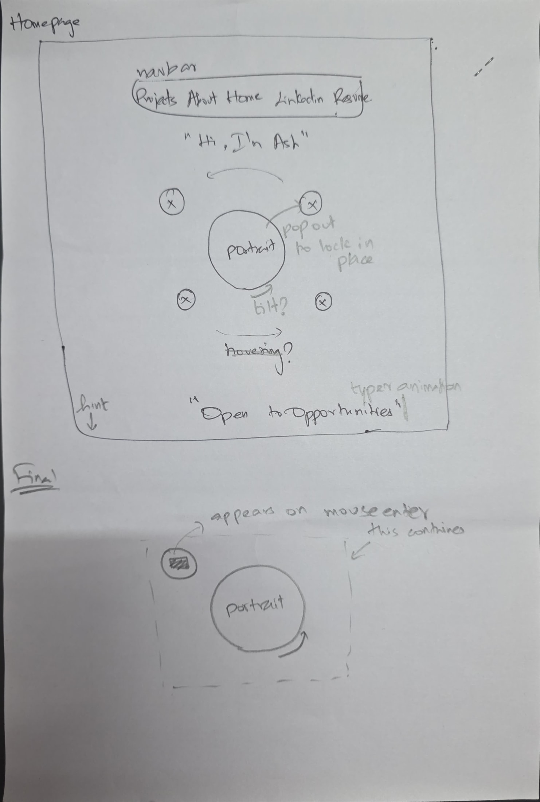
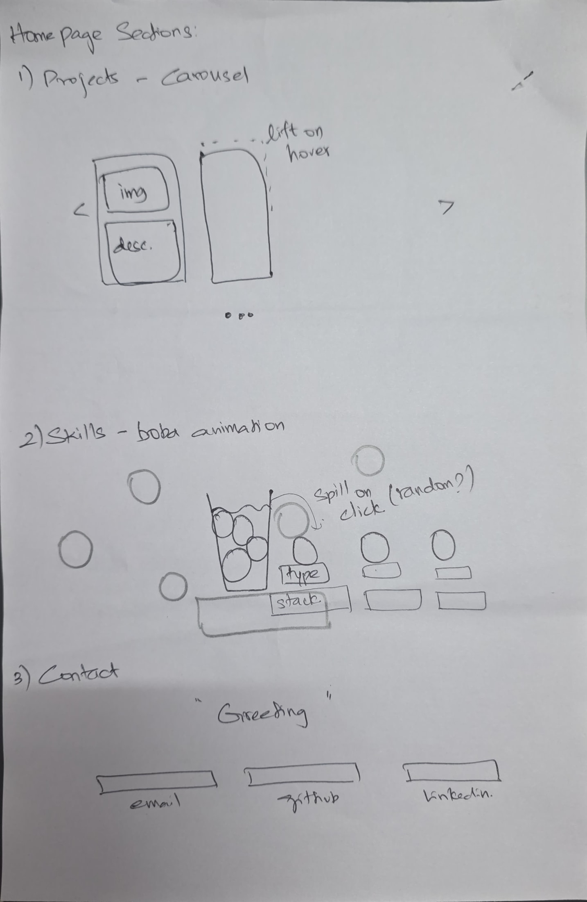
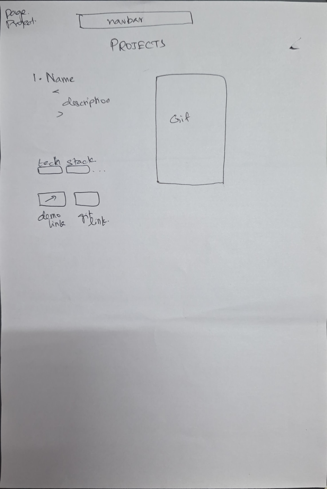

# Design Document — Aishwarya Rajmohan Personal Homepage

---

## Project Description

This is a personal portfolio homepage built as part of CS 5610 Web Development at Northeastern University. The site serves a dual purpose — fulfilling the course requirements for a multi-page static frontend project, and functioning as a real job-search portfolio for full-time roles in full stack development.

The site presents four pages: a home page with an interactive hero, a projects showcase and a detailed about page with a work experience timeline which is AI-generated. It is built entirely with vanilla HTML5, CSS3, and ES6+ JavaScript — no frameworks, no component libraries, no jQuery. Every interaction and animation was built from scratch as a learning exercise and a demonstration of frontend capability.

While this started as a curriculum assignment, I wanted to use the time to build something worthwhile — a portfolio that reflects my actual personality and creativity rather than a generic template. I have some frontend experience but never had the space to explore it creatively before. This project gave me that space.

I drew inspiration from design blogs, portfolio showcases, and creative developer sites, and used it as an opportunity to learn techniques I hadn't worked with before — CSS keyframe animations, clip-path, IntersectionObserver, and 3D CSS transforms. The boba tea theme, the quirky typewriter phrases, the interactive skills cup, and the bold colour palette are all deliberate choices to make the site memorable and human rather than corporate and generic.

---

## User Personas

### Persona 1 — Sarah, The Technical Recruiter

**Age:** 34
**Role:** Technical Recruiter at a mid-size product company
**Location:** Remote, US-based
**Device:** Laptop, occasionally mobile between calls
**Tech literacy:** Moderate — understands job titles and tech stacks, not deep on architecture

**Goals:**

- Quickly assess whether a candidate matches an open role
- Find contact information and resume without hunting
- Get a sense of the candidate's communication style and personality
- Share the profile with a hiring manager if it looks promising

**Frustrations:**

- Portfolios that bury the tech stack deep in the page
- Sites that take too long to load or are hard to navigate
- No clear indication of availability or what the candidate is looking for
- Walls of text with no visual hierarchy

**How she uses the site:**
Sarah opens the link from LinkedIn on her laptop. She has about 90 seconds before her next call. She needs to know: what do you do, what have you built, are you available.

---

### Persona 2 — Raj, The Engineering Manager

**Age:** 42
**Role:** Engineering Manager at a large enterprise tech company
**Location:** Office, desktop
**Device:** Desktop with a second monitor
**Tech literacy:** High — 15 years in software, strong opinions on system design

**Goals:**

- Verify real-world impact — numbers, scale, complexity
- Understand how the candidate thinks and communicates about technical problems
- Assess whether the candidate would fit the team's current needs
- Read the resume in context of the portfolio

**Frustrations:**

- Vague bullet points with no measurable outcome
- Portfolios that look polished but have no substance behind the design
- No clarity on the candidate's seniority level or domain expertise
- Generic project descriptions that could apply to anyone

**How he uses the site:**
Raj gets the link forwarded from Sarah. He opens it on his second monitor while working. He goes straight to About, reads the bio, scrolls the timeline. He's looking for evidence — dollar amounts, system scale, technologies he recognises. He downloads the resume. He opens the GitHub link in a new tab.

---

### Persona 3 — Maya, The Peer Developer

**Age:** 26
**Role:** Mid-level frontend developer, active in developer communities
**Location:** Anywhere — phone, laptop, desktop
**Device:** All of the above
**Tech literacy:** High — inspects source code, notices implementation details

**Goals:**

- Understand how the interactions were built
- Get inspired for her own portfolio
- Connect with someone whose work she finds interesting
- Possibly share the site in a community or Discord

**Frustrations:**

- Portfolios built on Webflow or Framer that claim to be "coded"
- Interactions that look impressive but are just CSS templates
- No transparency about tech choices or process
- Sites that look identical to a dozen others

**How she uses the site:**
Maya sees the link shared in a developer Discord. She opens it on her phone, immediately taps the portrait to see the orbit icons. She scrolls to Skills, taps the cup, watches the boba explode. She opens DevTools on desktop, checks the JS modules, reads the IntersectionObserver logic. She shares the link with a comment: "the boba section is actually unhinged (compliment)."

---

## User Stories

### Story 1 — Sarah finds a match

It's a Tuesday afternoon and Sarah has a role open for a Senior Backend Developer — Java, Spring Boot, cloud experience preferred. She's been through twelve portfolios this week and they all look the same: hero image, three project cards, a contact form.

She opens Aishwarya's link. The page fades in. A purple hero loads with a portrait at the center and the words _Hi, I am Aishwarya_ above it. The typewriter below cycles to _Open to Opportunities_ — Sarah notices that immediately. She hovers the portrait out of curiosity and three icons spring out. She clicks Projects.

Two project cards load — she scans the tags. She clicks the first card, reads the description. She clicks About in the navbar, scrolls down to the timeline. PayPal, Walmart, EY — six years of experience. She sees _$143,000 saved annually_ in bold pink and stops. She downloads the resume from the navbar. She copies the LinkedIn URL and pastes it into her ATS with a note: _strong full stack match, creative portfolio, follow up Thursday._

Total time on site: 60 seconds.

---

### Story 2 — Raj digs deeper

Sarah forwards Raj the portfolio link with a note: _Java backend, 5 years, PayPal + Walmart, strong resume. Worth a look._

Raj opens it on his second monitor at 9am before standup. He skips the hero — he'll come back to it — and clicks About directly. He reads the bio. _I don't just fix broken things — I like understanding why they broke and making them genuinely better._

He scrolls the timeline. Walmart: mainframe-to-cloud migration, Kafka, CDC connectors, $143k in cloud cost optimisation. He keeps scrolling. PayPal: distributed rate limiting, JDK upgrades, security compliance. EY: iOS, GraphQL.

He goes back to the home page. He scrolls to Skills and clicks the boba cup — the balls scatter across the screen. He hovers _Architecture_. "Microservices, Event-Driven Architecture, RESTful APIs." He smiles slightly. He opens the GitHub link from the contact section. He forwards the portfolio to his tech lead with a message: _take a look, I think she's worth a conversation._

---

### Story 3 — Maya finds inspiration

Maya is in a developer Discord server when someone drops a link with the message: "found this portfolio, the skills section is cool." She opens it on her phone at 11pm.

The page loads with a fade. She sees the purple hero and immediately tries hovering the portrait on her phone — tap, and the orbit icons pop out. She taps Projects and swipes through the carousel. She taps Skills.

She sees the boba cup with a hint that says _click to spill · hover to explore._ She taps it. The nine balls fly out across the section and settle in random positions. She taps one — _Backend_ — and a panel appears: "Spring Boot, Spring MVC, Spring Cloud, Hibernate, JPA, Node.js." She taps a few more.

She switches to her laptop and opens DevTools. She finds `boba.js`, reads through the `IntersectionObserver` logic, the `DROP_POSITIONS` array. She opens `tilt.js`. She spends twenty minutes reading through the source.

She screenshots the skills section and posts it in the Discord: "okay the boba animation and audio is impressive for a vanilla JS portfolio. saving this"

---

## Design Mockups

Figure 1: Hero section 
Figure 2: Projects and Skills sections 
Figure 3: Projects page 

---

## Design Decisions

### Colour palette

Five-variable CSS custom property system — the entire site theme can be swapped by changing five lines in `:root`. Final palette uses mid-purple (`#804595`) as the hero background, white surfaces for content sections, and pink (`#d876a9`) as the primary accent. Chosen for its balance between bold personality and professional legibility.

### Typography

Playfair Display (serif) for display headings — editorial, confident, distinctive. DM Sans for body text — clean, modern, highly readable at small sizes. Caveat for the navbar logo — handwritten, personal. All loaded via Google Fonts.

### Layout approach

Flexbox for component-level layout (navbar, hero, contact links, timeline cards). No Bootstrap grid — all layout is custom.

### Interaction philosophy

Every interaction has a clear purpose and a clear reset state. The orbit icons return to center on mouse leave. The boba balls return to the cup on second click. The timeline animates in on scroll and resets when out of view. Nothing persists in a broken state.

### Accessibility

All interactive elements use semantic HTML (`<button>`, `<a>`, `<nav>`). Images have `alt` attributes. Icon-only elements use `aria-hidden="true"` with a labelled parent. Orbit icon links use `aria-label`. The skill detail panel uses `aria-live="polite"` for screen reader announcements.
