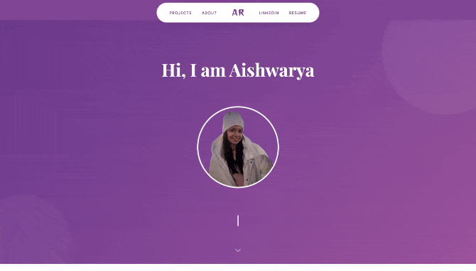
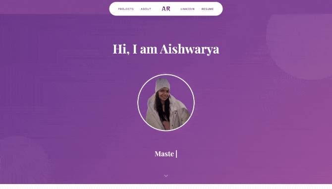
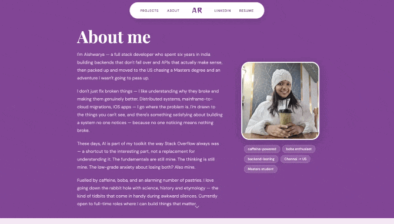

# Aishwarya Rajmohan — Personal Homepage

A front-end only static portfolio site built with vanilla HTML5, CSS3, and ES6+ JavaScript.

---

## Author

**Aishwarya Rajmohan**
Full Stack Developer · Masters Student at Northeastern University
[LinkedIn](https://linkedin.com/in/aishwaryamohan1698) · [GitHub](https://github.com/aish6498-hub)

---

## Class Link

[CS 5610 — Web Development](https://johnguerra.co/classes/webDevelopment_online_summer_2026/)

---

## Deployment

The site is deployed on GitHub Pages at:
[Portfolio](https://aish6498-hub.github.io/portfolio)

---

## Design Doc

[Design Doc](./DESIGN.md)

---

## My Project Objective

Build a personal homepage that functions as both a course deliverable and a real job-search portfolio. The site showcases work experience, projects, and skills through creative, interactive UI components built entirely from scratch — no libraries, no shortcuts.

While this started as a curriculum assignment, I wanted to use the time to build something genuinely worthwhile — a portfolio that reflects my actual personality and creativity rather than a generic template. I have some frontend experience but never had the space to explore it creatively before. This project gave me that space.

I drew inspiration from design blogs, portfolio showcases, and creative developer sites, and used it as an opportunity to learn techniques I hadn't worked with before — CSS keyframe animations, clip-path, IntersectionObserver, and 3D CSS transforms.

### Creative additions beyond the brief

- **Portrait tilt effect** — on hover, the portrait swings open like a door using CSS `perspective` and `rotateY`, revealing three orbit icons that spring out from behind it using a cubic-bezier bounce easing
- **Orbit icons** — icons that fly out from the center of the portrait on hover, each linking to a section of the page, with a staggered pop animation and smooth return on mouse leave
- **Typewriter effect** — a cycling phrase display below the portrait, built as a reusable ES6 module with configurable speed, delete rate, and pause duration
- **Project carousel** — a custom-built card carousel with dot navigation, prev/next buttons
- **Boba skills animation** — boba balls drop into a cup on scroll using `IntersectionObserver`, stack in a 2-3-4 hexagonal packing pattern, explode across the section on click, and show skill details on hover with a tooltip — all driven by a single ES6 module
- **Web Audio** — a sound plays when the boba animation triggers with `currentTime` reset for replay
- **Work experience timeline** — alternating left-right scroll-triggered timeline with slide-in animations, award badges, sub-project labels, and impact numbers highlighted in accent colour
- **Hero entrance animations** — staggered `fadeSlideUp` keyframe animations on the greeting, portrait, and typewriter text on page load
- **Portrait glow pulse** — a continuous radial glow animation on the portrait border
- **Floating pill navbar** — fixed, centered, responsive navbar with a frosted appearance and active page highlighting
- **Page fade-in** — subtle `translateY` + `opacity` entrance animation on `<main>` for every page transition
- **Scroll indicator** — animated bouncing chevron at the bottom of the hero
- **Themed colour system** — a 5-variable CSS custom property palette that lets the entire site theme be swapped by changing only 5 lines

---

## Screenshot/Gif

Homepage:


Projects page:



About me page (AI generated):



Mobile view responsiveness captured:


---

## Pages

| Page                        | Description                                               |
| --------------------------- | --------------------------------------------------------- |
| `index.html`                | Hero, Projects carousel, Skills (boba animation), Contact |
| `about.html` (AI generated) | Bio, Work experience timeline, Education                  |
| `projects.html`             | Detailed project pages with GIF demos                     |

---

## Tech Stack

- HTML5 — semantic structure, accessibility attributes
- CSS3 — custom properties, flexbox, grid, animations, `@keyframes`
- ES6+ — modules (`type="module"`), `IntersectionObserver`, `async/await`
- Font Awesome 6.5 — icons
- Google Fonts — Playfair Display, DM Sans, Caveat

### Resources

- Favicon - to build the icons for html meta
- Pixabay - https://pixabay.com/sound-effects/search/bubble%20pop/ for the boba animation sound
- PaletteMaker - https://palettemaker.com/app to decide on the color pallete

---

## Project Structure

```
/
  index.html
  about.html
  projects.html
  /css
    styles.css
    about.css
    projects.css
  /js
    main.js
    tilt.js
    typewriter.js
    carousel.js
    boba.js
    about.js
    projects.js
  /assets
    resume.pdf
    portrait.png
    portrait-2.png
    boba-cup.png
    /projects
      project-1-gif.gif
      project-2-gif.gif
      project1.png
      project2.png
    /icons
      favicon.ico
      favicon.png
      favicon-512x512.png
    /audio
      boba-drop.mp3
  package.json
  package-lock.json
  eslint.config.mjs
  LICENSE
  README.md
  .gitignore
```

---

## Instructions to Build

### Prerequisites

- [Node.js](https://nodejs.org/) v16 or higher
- npm (comes with Node.js)

### Install dependencies

```bash
npm install
```

### Run locally

```bash
npm start
```

This starts `live-server` and opens the site at `http://127.0.0.1:8080`. The page reloads automatically on file changes.

### No build step required

This is a static site — no compiler. All JS uses native ES6 modules (`type="module"`). Open `index.html` directly in a browser or use any static file server.

---

## GenAI Usage

This project used AI tools as a collaborative aid during development — not to generate the site, but to accelerate specific decisions and debug tricky interactions. All code was reviewed, understood, and adapted before use. The thinking, design decisions, and creative direction were entirely my own.

### Tools used

| Tool               | Version           |
| ------------------ | ----------------- |
| Claude (Anthropic) | Claude Sonnet 4.5 |

### How it was used

- **Ideation** — bouncing layout and interaction ideas, getting feedback on colour palettes and typography pairings before committing
- **Debugging** — diagnosing why CSS transitions weren't firing, why `position: fixed` was breaking, why boba balls weren't coming from center
- **Enhancement suggestions** — asking what would make a section feel less plain, what easing curve would feel more natural, how to make an animation feel more alive
- **Snippet generation** — requesting small targeted snippets for specific problems, not full page generation
- **Code review** — catching duplicate CSS rules, unused variables, and accessibility gaps
- **Text content generation** — using project read me files and resume pdf to generate the info to be displayed in UI - validated afterwards

### Sample prompts used

```

"the hero feels plain, what are some ways to make it more lively without cluttering it?"

"what easing would make the boba balls feel like they are bouncing when they land?"

"icons are popping out but they look tilted, why and how do i fix it?"

"how do i make the orbit icons appear to come from behind the portrait rather than just fading in?"

"the liquid level in the boba cup, can we make it rise as each ball drops in?"

"what is the difference between position fixed and sticky, which is right for my navbar?"

"the page transition feels abrupt, what is a subtle way to animate it?"

"colour palette suggestions for bold, fun, quirky — white pink lilac and violet tone - use this layout and replace the colours so i can check what looks nice"

"how do i replay a CSS animation every time a section scrolls into view?"

"the skill detail panel is too small and hard to read, how do i make it more pronounced?"

"create a clear and descriptive README including: Author, Class Link, Project Objective, Screenshot, Instructions to build"

```

## License

[MIT](./LICENSE)
